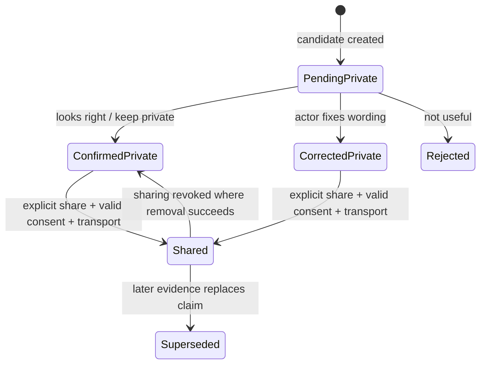

# Slice 2 readiness: trustworthy field memory

Status: implementation-ready design brief  
Scope: Helen → Lotus knowledge capture, review, recurrence, and continuity  
Decision: harden custody and provenance before exposing knowledge-drop UI

## Why this slice exists

WOLF is not trying to make experienced operators maintain another knowledge-management system. It is trying to make the useful structure already present in their work visible, reviewable, and durable.

Helen and Lotus should be able to answer ordinary prompts in ordinary language. WOLF may propose a small, source-linked detail from that answer. They decide whether it is useful. A steward can later resolve shared details. An owner can compare genuinely independent cases. Only verified procedures can become successor-facing instructions.

That sequence protects the core promise:

> Capture lived operational experience once, preserve exactly where it came from, and turn it into reusable help without pretending that a model inference is a fact.

## Current truth

The repository now has a tested local knowledge-drop foundation:

- typed knowledge drops and review decisions;
- deterministic drop identifiers;
- IndexedDB storage and maintenance coverage;
- synthetic Helen → Lotus playtest artifacts;
- a manual-LLM handoff pattern that requires no runtime model API;
- a full green check, including unit, storage, worker, component, build, and browser tests.

It does **not** yet have:

- a production candidate extractor wired to answer commit;
- a field receipt or correction UI;
- a real workspace transport for shared drops;
- consent grants;
- collision-safe writes tied to stored revisions;
- cascade deletion and portable backup for knowledge data;
- append-only, concurrency-safe review events;
- recurrence or procedure data models;
- a steward refinery, owner pattern view, or successor procedure runner.

Any UI that claims those absent capabilities would be theatre. Slice 2 must establish the truth underneath the screen first.

## Release blockers

### P0 — custody and truth

1. **Create from stored evidence.** A caller must not supply a quote and claim it came from a revision. The repository loads the stored revision, verifies its digest and span, and derives the quote itself.
2. **Reject identifier collisions.** Reusing a deterministic `dropId` for non-identical content must fail. `put()` must not silently replace evidence.
3. **Keep pending data private.** A candidate cannot become workspace-visible before a person confirms it and an applicable consent grant permits sharing.
4. **Separate review from visibility.** “Keep private” confirms usefulness but does not publish. Semantic status and disclosure status are different axes.
5. **Make deidentification real.** A label is not a privacy transform. A deidentified pattern must be a separate artifact with no quote, source IDs, names, exact addresses, rare identifying combinations, or reversible pseudonyms.
6. **Delete residue.** Deleting a source record must remove every source-bearing drop and its events. A pattern may survive only if it was already irreversibly deidentified and consent explicitly permits aggregate retention.
7. **Back up the knowledge layer.** Export/import must include drops, events, consent grants, schema versions, and integrity data. A device-local database is not durable continuity by itself.
8. **Validate at the storage boundary.** Schema, lifecycle transitions, source references, spans, digests, and visibility constraints must be checked inside repository operations.
9. **Use append-only review events.** Embedded mutable history is insufficient. Events need sequence numbers, optimistic concurrency, request idempotency, actor identity/role, and digest chaining.
10. **Model consent.** Sharing, manual subscription processing, deidentified aggregation, recipients, geography, expiry, and withdrawal must be explicit.

### P1 — hosted safety

Hosted survey submission currently validates records shallowly and accepts an arbitrary analysis-shaped payload. Before knowledge custody uses Cloudflare:

- validate complete versioned payloads at runtime;
- store knowledge data in dedicated tables/objects, not as opaque analysis;
- require authorization on the server, not only route visibility in the UI;
- add conditional writes or ETags, idempotency keys, and monotonic event sequences;
- expire and rotate capability tokens;
- support member revocation, remote erasure, and hosted custody export;
- never persist full bearer capabilities in browser storage when a narrower session can be used;
- update privacy language to describe exactly what is local, what is hosted, and what is sent to a manual LLM session.

Until those gates pass, `workspace` is a future intent—not a functioning transport.

## Corrected domain model

The model separates evidence, decisions, consent, patterns, and procedures. They have different truth conditions and lifecycles.

```ts
interface KnowledgeDrop {
  schemaVersion: number
  dropId: string
  collectionId: string
  workspaceId: string | null
  source: {
    recordId: string
    promptId: string
    revisionId: string
    revisionDigest: string
    offsetEncoding: 'utf16-code-unit'
    startOffset: number
    endOffset: number
    quoteDigest: string
  }
  kind:
    | 'symptom'
    | 'workaround'
    | 'constraint'
    | 'decision_rule'
    | 'unwritten_rule'
    | 'failure_mode'
    | 'exception'
    | 'success_condition'
  currentText: string
  operationalPattern: string | null
  lifecycle: 'pending' | 'confirmed' | 'corrected' | 'rejected' | 'superseded'
  custody: {
    visibility: 'private' | 'workspace'
    sensitivity: string
    consentGrantId: string | null
    retentionClass: string
    expiresAt: string | null
  }
  extraction: {
    method: 'deterministic' | 'manual_llm' | 'human'
    runId: string
    toolLabel: string | null
    promptContractVersion: string | null
  }
  version: number
  createdAt: string
  updatedAt: string
}

interface KnowledgeDropEvent {
  eventId: string
  dropId: string
  sequence: number
  expectedPriorVersion: number
  eventType: string
  actorId: string
  actorRole: string
  occurredAt: string
  requestId: string
  priorEventDigest: string | null
  payload: unknown
  eventDigest: string
}

interface ConsentGrant {
  id: string
  subjectRecordId: string
  grantedBy: string
  purposes: string[]
  allowedRecipientClasses: string[]
  permitsManualSubscriptionProcessing: boolean
  permitsWorkspaceSharing: boolean
  permitsDeidentifiedAggregation: boolean
  geographicDisclosureLevel: string
  grantedAt: string
  expiresAt: string | null
  withdrawnAt: string | null
}
```

`DeidentifiedPattern` is a separate, publishable artifact. `SolutionPatternVersion` is a versioned reasoning aid, not an inferred fact:

```ts
interface SolutionPatternVersion {
  patternId: string
  version: number
  title: string
  kinds: KnowledgeDrop['kind'][]
  retrievalTerms: string[]
  eligibility: string[]
  exclusions: string[]
  discriminatingQuestions: string[]
  cornerstoneEpisodeIds: string[]
  counterexampleEpisodeIds: string[]
  status: 'draft' | 'trial_ready' | 'reviewed' | 'retired'
  supersedes: string | null
}
```

A future `VerifiedProcedureVersion` must include prerequisites, stop conditions, fallback, proof of success, primary and alternate owners, observed outcomes, and drill history. A confirmed drop is evidence; it is not yet an instruction.

## Required repository operations

The storage API should make unsafe states difficult to express:

```ts
createDropFromStoredRevision(input)
appendDropEvent(input)              // compare-and-swap + request idempotency
listDropsForPrincipal(principal)
publishDeidentifiedPattern(input)
deleteRecordWithResidue(recordId)
withdrawConsent(consentGrantId)
exportKnowledgeArchive()            // .wolfkb.json
importKnowledgeArchive(archive)
exportShareablePatterns()
```

### Exact-source contract

1. Freeze the source revision and calculate SHA-256.
2. Use UTF-16 code-unit offsets because that is the native JavaScript string indexing contract.
3. Load the revision in the repository transaction.
4. Reject a mismatched revision digest, invalid boundary, or quote digest.
5. Derive the stored quote from the revision; never trust a caller-provided quote.
6. Generate stable IDs from revision ID, span, kind, and extractor version.
7. If that ID exists, return it only when immutable identity fields match exactly; otherwise report a collision.

This contract needs explicit emoji/surrogate-pair and repeated-quote fixtures.

### Lifecycle and disclosure state



Review never implicitly publishes. Consent withdrawal closes future use and initiates required deletion. Remote removal failures must be visible and retryable rather than described as complete.

## Candidate extraction without runtime token calls

Start with deterministic, high-precision candidates. Do not begin with embeddings or semantic search.

Candidate lanes:

1. **Evidence extraction** — identify a precise claim and source span.
2. **Recurrence retrieval** — find cases worth comparing.
3. **Applicability decisions** — humans decide whether a known pattern fits the present address, code, asset, supply, and staffing context.

Useful deterministic grammars include:

- decision rule: `if`, `when`, `unless`;
- constraint: `must`, `cannot`, `only`, hidden dependencies;
- failure mode: no owner, predictable failure, drift;
- workaround: `I/we ... before/because`;
- exception: `except`, `unless`;
- success condition: `works when`, `done when`, `verify by`.

The extractor should prefer zero candidates over vague ones. It must not rewrite the answer or present a classification as certainty.

### Manual subscription handoff

The manual-LLM loop remains useful for richer candidate generation without API billing:

1. WOLF freezes selected source revisions and their digests.
2. WOLF exports the task, allowed source set, response schema, and safety constraints.
3. A human runs that handoff in an existing ChatGPT or Claude subscription.
4. The return must cite source digest, exact offsets, and exact quote.
5. Import rejects unknown keys, missing sources, invalid spans, mismatched digests, duplicate request IDs, and non-deterministic ordering.
6. Every imported candidate starts `pending` and `private`.
7. A person confirms, corrects, or rejects it.

The model proposes structure. It does not create authority, consent, recurrence, causality, or publication.

## Recurrence and known-solution reasoning

Similarity is a retrieval aid only. It must not imply that two cases share a cause, that a solution applies, or that a pattern is safe to publish.

Supported relationships should be explicit:

- `exact_duplicate`
- `restatement`
- `supports`
- `contradicts`
- `possible_recurrence`
- `explicit_causal_link`
- `pattern_applicability`

Count independent operational episodes, not quotes or revisions. Track polarity and negation before matching. A rejected match becomes a counterexample or new discriminator; the system should not rewrite history to make its pattern look cleaner.

### Conservative promotion ladder

1. One reviewed episode: candidate evidence only.
2. Two independent episodes: possible local recurrence.
3. Complete context and exclusions: trial-ready pattern.
4. One successful, owner-approved outcome: local recipe candidate.
5. Three successful episodes across at least two people or sites, with no unresolved counterexample: eligible for broader steward review.

Safety-, law-, permit-, code-, and address-sensitive material never auto-promotes. It requires authoritative current sources and qualified approval. Availability and rules are time-dependent facts and need freshness metadata.

## Four legible product surfaces

Each surface gives one actor one dominant verb and a receipt appropriate to their authority.

| Surface | Actor | World shown | Dominant verb | Receipt |
| --- | --- | --- | --- | --- |
| Field receipt | Helen or Lotus | exact answer + proposed detail | Confirm | private source-linked note |
| Refinery | steward | unresolved shared detail + provenance | Resolve | append-only review event |
| Pattern view | owner | reviewed drops + possible recurrence | Compare | recurrence decision |
| Continuity | successor | verified procedure or readiness gaps | Run | outcome evidence or gap |

Avoid points, streaks, leaderboards, and completion confetti. The useful game-design idea is legible state and consequence, not gamification.

### A. Field receipt

Integration point: after answer commit in `src/app/screens/PromptScreen.tsx`.

Proposed component: `KnowledgeDropReceipt.tsx`.

Copy:

> **Useful details from this answer**  
> WOLF marked these because they may save explanation next time. They are suggestions linked to your answer. Your original words have not changed.

Each card shows the exact quote and a plain-language kind:

| Internal kind | Field label |
| --- | --- |
| symptom | something wrong |
| workaround | way around |
| constraint | condition this depends on |
| decision_rule | rule that changes the action |
| unwritten_rule | rule learned through the work |
| failure_mode | predictable way this fails |
| exception | when the normal rule does not fit |
| success_condition | what must be true when it works |

Actions:

- primary: “Looks right — keep it” (confirms privately);
- secondary: “Fix the wording”;
- tertiary: “Not useful.”

States:

- checking;
- no candidate: “Answer saved. WOLF has nothing to ask about this answer right now.”;
- candidate pending;
- saved privately;
- failure: “Your answer is safe. WOLF could not prepare useful details from it.”

The initial UI must not offer workspace sharing until consent and actual transport exist.

Accessibility requirements: labelled section, semantic heading and blockquote, 44px targets, polite save status, alert errors, correction focus management, no forced autofocus, and no color-only status.

### B. Steward refinery

Use a separate `#/knowledge/review` screen rather than adding a dense workflow to Records.

Proposed components:

- `KnowledgeRefineryScreen.tsx`
- `KnowledgeDropCard.tsx`
- `knowledge.css`

Records may show only a link and unresolved count. Private drops must be absent and their count must not leak. A review card shows exact source, identity, extraction method, consequence, and history. The dominant action is “Resolve this detail.” Model-generated candidates must not support batch approval.

Operator-session context may simplify the interface, but the repository and hosted service must still enforce authorization.

### C. Owner recurrence view

Proposed routes and components:

- `#/knowledge` → `KnowledgeOverviewScreen.tsx`
- `#/knowledge/pattern/:patternKey` → `KnowledgePatternScreen.tsx`
- `RecurrenceCandidateCard.tsx`
- `src/knowledge/recurrence.ts`

Only confirmed or corrected workspace drops with available sources may participate. The label is **Possible recurrence** and the action is **Compare cases**. One case is never a recurrence.

The comparison asks:

1. What appears the same?
2. What materially differs?
3. Is the cause known or only correlated?
4. Which eligibility and exclusion conditions apply here?
5. What evidence would confirm success or falsify the pattern?

If solution, local fit, recipe, or authoritative verification is absent, show “not established.”

### D. Successor continuity view

Do not render observations as runnable instructions. Until a procedure model exists, `#/continuity` is a guarded readiness view:

> No handoff-ready procedures exist yet. Confirmed observations are evidence, not instructions.

Show the missing proof plainly: zero verified recipes, prerequisites, fallbacks, alternate owners, or drills. Once implemented, a successor procedure must expose stop conditions and require an outcome receipt.

## Integration map

| Concern | Current seam | Slice 2 change |
| --- | --- | --- |
| answer commit | `src/app/screens/PromptScreen.tsx` | call candidate provider only after revision commit |
| receipt | saved-answer area in PromptScreen | render private pending candidates and review actions |
| routes | application router | add refinery/pattern/readiness routes only as their gates pass |
| record list | Records screen | link/count only; never expose private drops |
| storage | `src/storage/knowledgeRepository.ts` | exact-source creation, validation, collision rejection, CAS events |
| database | `src/storage/db.ts` | new stores and migration for events/consent/patterns |
| deletion | record repository/maintenance | transactional source-residue cascade |
| backup | export/import bundle | add versioned `.wolfkb.json` custody archive |
| hosted sync | Cloudflare worker/schema | defer knowledge sharing until server custody contract exists |
| privacy | privacy/help documentation | disclose knowledge store, manual handoff, retention, deletion, sharing |

## Verification matrix

### Storage and provenance

- creates a drop only from an existing stored revision;
- rejects wrong revision digest, quote digest, bounds, and prompt/record mismatch;
- handles repeated quotes deterministically;
- handles emoji and surrogate-pair boundaries;
- returns an identical existing drop idempotently;
- rejects non-identical same-ID content;
- rejects pending workspace visibility;
- confirms privately without changing visibility;
- requires valid, unwithdrawn consent before sharing;
- appends events in sequence with compare-and-swap;
- deduplicates repeated request IDs;
- detects broken digest chains;
- denies private data to unauthorized principals;
- cascades deletion through source-bearing drops and events;
- preserves only eligible pre-deidentified aggregates;
- round-trips a complete knowledge archive;
- rejects incompatible or corrupt imports.

### Extraction and matching

- emits stable candidates for supported high-precision grammar;
- emits none for ambiguous text;
- preserves exact spans and original wording;
- treats negation and polarity distinctly;
- counts multiple revisions of one event as one episode;
- does not join same words from incompatible contexts;
- does not infer causality from co-occurrence;
- applies exclusions before suggesting applicability;
- records a rejected match as a counterexample;
- produces deterministic ordering;
- never auto-promotes code- or safety-sensitive claims.

### Field receipt

- appears only after the answer revision is committed;
- cannot alter the original response;
- supports confirm, correct, and reject;
- defaults every candidate to private;
- shows safe empty and extractor-failure states;
- announces asynchronous state accessibly;
- returns focus sensibly after correction;
- never displays a workspace-share affordance before transport and consent gates pass.

### Refinery

- excludes private drops and does not leak their count;
- shows exact provenance and extraction method;
- rejects stale concurrent decisions;
- writes append-only actor-attributed events;
- does not batch-approve model candidates;
- shows revoked consent and deletion state;
- enforces server/repository authorization independently of the UI.

### Recurrence

- requires at least two independent episodes;
- labels retrieval as possible recurrence;
- exposes differences, exclusions, and counterexamples;
- says “not established” instead of inventing solution/local-fit fields;
- keeps current authoritative sources and freshness visible;
- requires qualified review for regulated or safety-sensitive use.

### Continuity

- refuses to present a drop as a runnable procedure;
- shows readiness gaps when no verified procedures exist;
- requires prerequisites, stops, fallback, proof, alternate owner, and drill state;
- records a successor outcome rather than a completion badge.

### Hosted custody

- validates versioned runtime schemas;
- rejects arbitrary analysis-shaped input;
- enforces roles and visibility on every read/write;
- supports idempotent conditional writes;
- expires, rotates, and revokes credentials;
- performs and reports remote erasure;
- exports a complete custody archive;
- never claims local-only behavior when hosted transmission occurs.

## Safest build order

### Slice 2A — trustworthy local evidence

1. Split semantic lifecycle from visibility.
2. Add exact-source digests and offset contract.
3. Replace caller-authored source text with `createDropFromStoredRevision`.
4. Reject collisions and add repository runtime validation.
5. Add append-only, CAS-protected drop events.
6. Add source-residue deletion.
7. Add full knowledge archive export/import.
8. Correct privacy documentation.

**Gate:** all provenance, collision, deletion, and round-trip tests pass.

### Slice 2B — private field receipt

1. Add deterministic candidate provider after committed revision.
2. Render the field receipt.
3. Implement confirm, correction, and rejection as events.
4. Add accessibility and failure-state tests.

**Gate:** candidates cannot mutate answers, escape private visibility, or survive source deletion.

### Slice 2C — consent and steward refinery

1. Add consent grants and withdrawal.
2. Add principal-scoped reads.
3. Add refinery route and single-item review.
4. Add concurrency and authorization tests.

**Gate:** no private-data leak, stale write, batch model approval, or consent bypass.

### Slice 2D — possible recurrence

1. Define operational episodes and normalized pattern keys.
2. Implement explicit relations, exclusions, and counterexamples.
3. Add owner compare view.
4. Version solution patterns and promotion decisions.

**Gate:** the UI never equates similarity with recurrence, causality, applicability, or a verified solution.

### Slice 2E — hosted custody

1. Design Cloudflare schemas from the same domain contract.
2. Implement server-side validation, roles, conditional writes, token lifecycle, deletion, and export.
3. Sync only confirmed/corrected drops with explicit consent.
4. Add observable retry and partial-failure states.

**Gate:** `workspace` means an actual, revocable, exportable transport.

### Slice 2F — verified continuity

1. Add versioned procedure and outcome models.
2. Require human approval and authoritative sources where applicable.
3. Add readiness view, then procedure runner.
4. Run a successor drill with no oral rescue.

**Gate:** a new operator can identify prerequisites, stop safely, use fallback, produce proof, and leave an outcome receipt.

## Definition of prepared

The project is prepared for implementation when the team can answer “yes” to all of these:

- Do we know which claims the current code can truthfully make?
- Is every proposed screen backed by a real state transition and repository operation?
- Can every derived detail be traced to an immutable source revision?
- Can we reject, revoke, delete, export, and restore it?
- Can private information remain private even if the UI is wrong?
- Can a model suggestion stay visibly provisional?
- Can two similar stories remain distinct until a human establishes recurrence?
- Can regulated, address-specific, and time-sensitive facts require current authority?
- Can a successor distinguish evidence from a verified instruction?
- Does each actor see one clear world, verb, consequence, and receipt?

With this brief, the next move is not another broad concept pass. It is Slice 2A: make the local evidence layer collision-safe, source-bound, deletable, and portable; then earn the field receipt.
